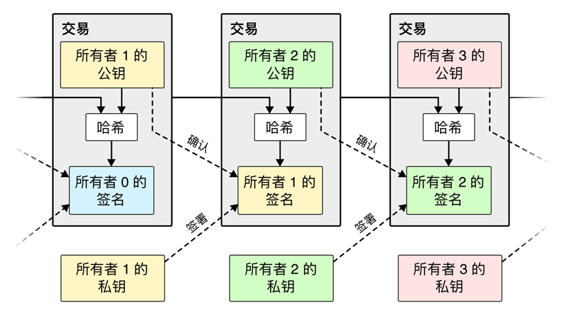
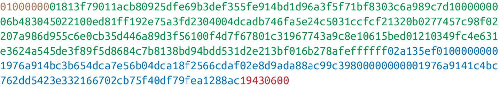
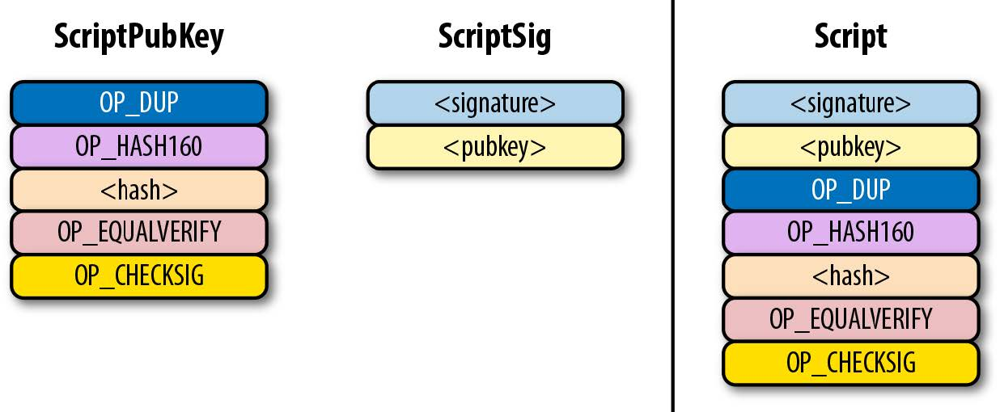
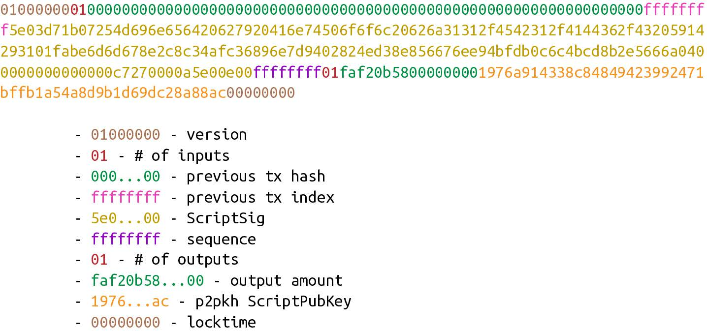
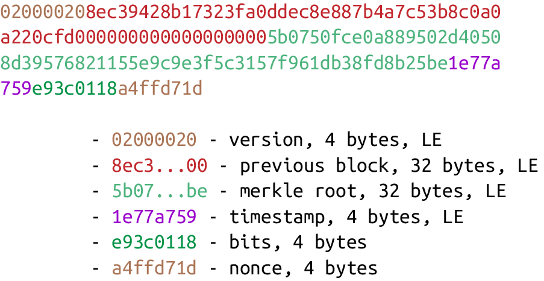
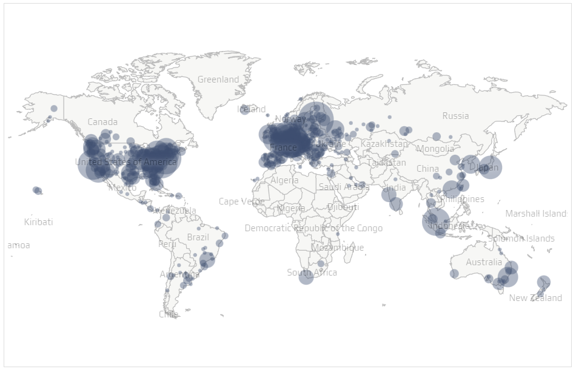
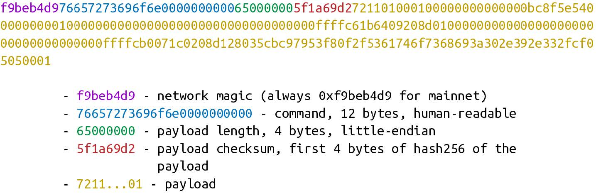

# 比特币学习笔记

[toc]

## 声明

这篇文章是个人学习笔记，文中使用的图片均标明了出处，文字部分的参考资料也尽可能标注引用，如有侵权，请联系 xuk1111@foxmail.com，我会尽快处理，谢谢。

## 摘要

比特币是一个点对点的电子现金系统。它将点对点网络、时间戳、非对称加密、工作量证明等技术结合起来，解决了分布式支付系统中双重支付的问题，通过挖矿奖励的形式激励更多的节点加入网络，保证比特币系统的安全性。比特币系统的治理方式同样是去中心化的，需经核心开发者、矿工、交易所、企业、用户等多方利益团体协商决定。比特币发展过程中，逐渐形成了比特币改进提案（BIP）作为系统升级的流程指南。时至今日，比特币已经让世界看到了它的价值，尽管还有待于更广泛的承认。比特币价值的真正展现，还有很长的路要走。 

**关键词：**比特币系统；工作量证明；挖矿；区块链；BIP

## 比特币诞生

最近读了一些关于比特币的资料，自以为对比特币系统有了一些粗浅的理解，所以把自己的认识整理一下。用一句话概括，比特币是一个点对点的电子现金系统[^1]。这篇笔记主要从技术角度阐述对比特币的理解，至于其经济、商业价值，不在讨论范围。

2008 年 10 月 31 日，中本聪（Satoshi Nakamoto）发布比特币白皮书，说明了自己发布这一系统的动机和实现思路框架。比特币的主要目的，是解决如何在不需要第三方中介的情况下保证交易双方完成支付过程，而其实现方式，则是采用点对点网络、时间戳、非对称加密等技术，生成交易记录的区块链（block chain），在比特币网络上验证区块和交易。而后，中本聪于 2009 年 1 月 4 日挖出第一个比特币区块（称为创世区块，genesis block）。截至 2022 年 5 月 17 日，比特币区块高度为 736772，即从创世区块开始之后的第 736772 个区块。

与我们日常生活接触到的客户端-服务器结构的中心化网络系统不同，比特币网络是一个分布式系统。这个网络中的所有节点都既可以作为服务器，也可以作为客户端。采用分布式系统的原因，如白皮书所言，是为了避免第三方金融机构参与支付过程而引发的信任成本，但更深层次的原因，就我所理解，则是为了避免当前货币发行主体的失信行为。

### 比特币之前的加密货币

在比特币之前，就有不少关于加密货币的尝试[^2][^3]。1989年，大卫·乔姆（David Chaum）创立了数字现金公司（DigiCash），这是第一家致力于解决线上支付问题的公司。这家公司的数字现金系统使用的现金叫做电子现金（Ecash），包括美国的几家银行和芬兰的至少一家银行在内的数家银行确实使用了这个系统。数字现金公司使用新颖的加密技术来保护用户隐私，同时解决双重支付问题，但其弱点在于需要一个中心化公司[^3]。1996 年成立的电子黄金（E-Gold）是第一批创建数字货币的网络公司之一。电子黄金发行了一种由黄金储备支持的数字货币，任何人都可以持有和转让。在鼎盛时期，电子黄金一年的交易额超过 20 亿美元。由于对注册几乎没有限制，这种货币被黑客、骗子和有组织的网络犯罪分子广泛采用[^3]。2008年所有电子黄金被冻结。1997 年 Adam Back 开发的 Hashcash[^4]，其中提到了工作量证明（proof of work，POW）机制。比特币中的工作量证明机制采用的是 Adam Back 的思路。1998年，Wei Dai 首次明确提出分布式记账的概念，并提出 b-money 方案[^5]，但其本身没有共识算法，安全要基于一些可信的服务器去做中间人，所以 b-money 不是一个真正可行的去中心化加密货币方案。1998 年，智能合约概念提出者尼克·萨博（Nick Szabo）提出了 Bit Gold 方案[^6]，方案中涉及到了一种解决拜占庭问题的共识机制。之后，2008 年，中本聪结合时间戳、工作量证明、分布式网络、密码学等已有成果，创造了比特币。

### 比特币白皮书

比特币白皮书，英文名为 **Bitcoin: A peer-to-peer electronic cash system**，翻译过来就是**比特币，一种点对点电子现金系统**，所以比特币系统其实是一个分布式记账系统，或者说是一个分布式账本。在这个账本中，每一笔交易都会被打上时间戳，作为这个交易在某个时间点之前已经存在的证据。一段时间内（平均是 10 分钟）的所有交易会被放到一起，作为一个区块。比特币网络中节点的工作，就是产生区块和验证区块。如果仅仅是这样，区块的产生没有任何难度，谁都可以产生区块，那么如何确定哪个节点产生的区块是合法的呢？为了解决这个问题，中本聪引入了工作量证明机制。工作量证明机制的本质其实是计算一种称为哈希函数（hash）的非线性函数，使得计算得到的结果满足特定要求。这种计算，需要耗费大量的计算机算力。这种通过耗费计算机算力，计算满足特定条件的区块头哈希值的行为称为挖矿，执行挖矿的人称为矿工。工作量证明机制下，第一个计算出满足条件的区块头哈希的矿工会获得一定数量的比特币作为区块奖励，这是每个区块所包含的第一笔交易记录，同时他也需要向整个比特币网络广播新的区块，其他矿工的工作就是验证区块，并把新区块加到已有的区块链上，所以工作量证明机制被称为节点之间达成共识的一种机制。虽然挖矿需要消耗相当的算力，但验证区块只需要执行一次哈希计算。为了减小比特币区块数据的存储占用，中本聪采用 Merkle 树保存每个区块中的交易信息。

比特币采用工作量证明机制的方法解决了拜占庭将军问题[^7]（更准确地说，是“绕过”了拜占庭将军问题[^8]），这是一种分布式网络的容错性问题：在分布式计算中，不同的计算机通过通讯交换信息、达成共识而按照同一套协作策略行动。但有时，系统中的成员计算机可能出错而发送错误的信息，用于传递信息的通讯网络也可能导致信息损坏，使得网络中不同的成员关于全体协作的策略得出不同的结论。比特币针对这个问题的解决方案是，让这个分布式网络在产生新区块的时候像一个中心化网络一样工作（更具体的内容见参考文献[^8]）。

### 区块链与比特币

比特币诞生初期，它和区块链几乎是指同一个东西。但随着比特币的发展，它的底层技术被提炼出来，产生了区块链技术。有人用这种技术制造山寨币，也有人推出新的区块链应用，如以太坊、EOS、超级账本等、Mixin、rum 等。

## 比特币系统基本要素

### 交易

 *比特币交易记录方式* [^9]

在比特币系统中，最基础的元素是交易。比特币的存在就是为了推出一种新的交易记录方式。如[上图](#transaction)所示，当所有者 1 从所有者 0 那里获得比特币之后，他想要将这些比特币转账给所有者 2，这时所有者 1 需要将自己接收到比特币的那笔交易记录（图中左边）进行哈希计算，并添加所有者 2 的公钥，最后所有者 1 用他的私钥对这笔交易进行签名。然后包括这条交易信息的一组交易记录会被打包进一个区块。其他节点确认过交易的合法性，并向整个比特币节点网络广播之后，所有者 2 可以用自己的私钥对所有者 1 发起的这条转账记录进行确认，验证交易，这样，他就得到了所有者 1 转账给他的比特币。为了避免双重支付问题，比特币系统采用时间戳记录每一笔交易发生的时间，并取时间上更早的交易为合法交易，此外，采用工作量证明机制，保证了**把自己的同一份比特币转账给多个人**在概率上几乎不可能，并且在经济成本上也不划算。

[下图](#detail)所示为一笔比特币交易记录的不同构成部分，包括版本、输入、输出、锁定时间，这些字符是经过哈希加密、base58 加密之后的十六进制编码，需要对应的解码方式才能获得正确的信息，文献[^10]对理解比特币所需的密码学基础、比特币编码方式进行了非常详尽的介绍。不同版本对应的指令代码会有不同。输入包括这份比特币的来源和所有者所有权的证明。输出包括转出金额和脚本公钥。锁定时间可用于延时交易。每一笔比特币交易，可以转账给多个人，所以可以有多个输出。转账时你花费的比特币可能是多笔交易的输出，所以一笔转账也可以有多个输入。[下图](#detail)中的转账交易有一个输入（绿色字符串头两个字符 `01`）和两个输出（蓝色字符串头两个字符 `02`）。关于比特币输入部分的理解，我想是为了**证明你的这笔钱是合法的，并且这笔钱确实是你的**。在中心化的支付系统中，这项工作由银行和第三方支付机构（如支付宝、微信支付）完成了。而在去中心化的支付系统中，这项工作就需要由发起转账的用户自己证明。每一笔比特币交易，其输入都是大于等于输出的，输入输出的差额称为交易手续费。这也是矿工收集交易并打包到区块的奖励。由于比特币是总量恒定的货币，当最后一个区块被挖出后，区块奖励就消失了。这时比特币节点就只能靠交易手续费获得收益。在实际的交易中，矿工们会优先收集手续费高的交集进行打包，而那些手续费低低交易，可能迟迟没有矿工认领。打包的快慢会影响比特币网络对一笔交易的确认。比特币网络平均每十分钟产生一个区块，一般认为当 6 个区块已经确认一笔交易之后，这笔交易才是事实上存在的。

*一条交易记录所包含的信息*（不同颜色分别标示出版本（棕色）、输入（绿色）、输出（蓝色）、锁定时间（红色）)[^10]

### 脚本

比特币脚本（script）用于编写智能合约（smart contract）。比特币中目前包含五种标准脚本，见[下表](#table-script)。每一条比特币交易的输出部分都包含这样的脚本。比特币脚本由公钥脚本 ScriptPubKey 和签名脚本ScriptSig 组成。比特币早期的交易采用 *p2pk*（pay-to-pubkey）作为公钥脚本，即每一笔交易中，发送方将比特币发送到接收方公钥生成的地址。接收方用自己的私钥生成签名脚本 ScriptSig 解锁该地址上的比特币。但这样生成的地址过长，所有者记忆、保存难度过大，并且会将公钥暴露出去，可能引发安全问题。后面几种脚本分别在安全性和交易速度上对 *p2pk* 进行了改进，包括对公钥先进行哈希变换（*p2pkh*）、多重签名（*p2sh*）、隔离见证（*p2wpkh*、*p2wsh*）。[下图](#p2pkh)所示为 *p2pkh* 脚本示例。比特币智能合约的基本工作原理用到了栈（stack）这一数据结构，关于它的工作原理更具体的解释见文献[^10]的第六章。

<a id='table-script'>**比特币包含的五种公钥标准脚本**</a>[^10]

| 缩写     | 全称                       | 备注     |
| -------- | -------------------------- | -------- |
| *p2pk*   | Pay-to-pubkey              | 公钥     |
| *p2pkh*  | Pay-to-pubkey-hash         | 公钥哈希 |
| *p2sh*   | Pay-to-script-hash         | 多重签名 |
| *p2wpkh* | Pay-to-witnes-pubkey-hash  | 隔离见证 |
| *p2wsh*  | Pay-to-witness-script-hash | 隔离见证 |

*p2pkh* 脚本 [^10]

### 区块

比特币交易中的签名和确认只能保证发送方确实给接收方发送了一些比特币，但如何保证发送方无法同时将这份比特币发送给多个人？日常的经验告诉我们，复制电子文本远比复制纸张上的文本容易得多。所以，比特币通过区块将交易打包起来，并将区块按照时间戳顺序连接起来，这样就可以按照交易所对应的时间戳阻止**将同一份比特币转账给多个人**的行为。比特币在交易速度需要的效率和保证安全性需要的时间戳检查频率之间选择了十分钟打包一个区块的方式，这种打包区块的方式，是通过工作量证明机制完成的。

*一个 coinbase transaction*  [^10]

在所有的比特币交易中，有一些交易只有一个 input（[上图](#coinbase)中红色的 `01`），并且这比交易的前一笔交易的哈希值是一串 0 （32 字节长），它前一笔交易的编号（index）是十六进制字符串 `ffffffff`。这笔交易是矿工们挖出新区块时获得奖励的交易，称为 coinbase transaction（[上图](#coinbase)）。这笔交易是每一个区块的第一笔交易。每一个区块由区块头和被打包的交易组成，其中区块头包括版本（version）、前一个区块的哈希（pervious block）、merkel 树根（merkle root）、时间戳（timestamp）、挖矿难度调整位（bits）和随机数（nonce）六个部分组成（[上图](#coinbase)）。

 

*比特币区块头信息*[^10]

工作量证明机制是整个比特币网络的一种保护机制，它其实是计算一种称为哈希函数（hash）的非线性函数，使得计算得到的结果满足特定要求，在比特币中这个要求被设定为使得计算结果以指定数量的 0 开头）。所谓工作量证明，就是证明一个矿工花费了足够的工作量（算力），得到了满足特定条件的区块头哈希，相应的奖励是比特币奖励，以及将自己打包的区块添加到原有区块链上的权利。与挖矿寻找区块哈希的艰难过程不同，验证过程只需要经过一次哈希计算就可以完成。这些以一定数量的 0 开头的哈希是十分稀有的，所以寻找这些哈希的过程可以类比为寻找金矿的过程。[上图](#header)中区块头的哈希值为：

`0000000000000000007e9e4c586439b0cdbe13b1370bdd9435d76a644d047523`

它的前面有 18 个零。当遍历所有随机数位（nonce）仍无得到满足条件的哈希值时，就需要调整 coinbase 交易中的部分数位以达成目标。为保证平均每 10 分钟挖出一个区块的速度，比特币设置了挖矿难度调节机制。通过在每 2016 个区块后进行一次难度调节的方式，保证平均 14 天挖出 2016 个区块，即平均 10 分钟一个区块的速度。这样，比特币数量不会随着算力增加而大幅增加，始终保持一个较为平稳的增长速度。在比特币诞生初期，只要一台笔记本电脑就可以实现挖矿，而到现在，则需要专业的矿机和矿池才能够较为经济地挖出比特币。此外，由于比特币最初就被设计为通缩型货币，故其总量有限，所以不可能无限发行。比特币在每 21 万个区块后会触发奖励减半机制，目前区块奖励为 6.25 个比特币。当前，比特币全网算力达到 220.97 EH/S，即每秒执行2$\times$10$^{20}$次哈希计算[^11]。

### 节点与网络

*比特币节点全球分布* [^12]

截至 2022 年 7 月 5 日，全球共有至少 15703 个比特币节点在运行，所有比特币节点构成一个点对点网络，[上图](#network)所示为截止 2022 年 7 月 5 日，全球可发现的比特币节点的分布情况。

比特币节点之间通过特定的协议进行通信，[下图](#connection)所示为比特币网络通信的一个示例。

*比特币网络通信示例* [^10]

每一条网络信息由网络标识串（network magic）、命令（command）、内容长度（payload length）、命令校验串（payload checksum）和命令内容（payload）组成。类似于 TCP 协议，比特币网络通信首先也要进行握手，握手过程如下：

1. 当节点 A 想要与节点 B 建立连接时，节点 A 向节点 B 发送它的通信协议版本信息（version）。
2. 节点 B 接收到节点 A 的协议版本信息后，向节点 A 发送节点 B 的 verack 信息和通信协议版本信息。
3. 节点 A 收到节点 B 的 verack 信息和协议版本信息之后，返回自己的 verack 信息。
4. 节点 B 收到节点 A 的 verack 信息，之后两个节点开始通信。

比特币网络上的节点之间可以请求、发送、接收和验证区块头信息。

## 比特币系统升级和改进

### 比特币的第一个重大安全漏洞 [^13][^14]

2010 年 8 月 15 日，黑客利用比特币漏洞，凭空制造出 1844 亿个比特币。在漏洞发生的 2 小时内，中本聪和安德烈森（Gavin Andresen）就成功地修补了漏洞并发布了网络更新，并呼吁所有网络节点将客户端升级到 0.3.10 版本。8 月 16 日凌晨 2 点，已有超过一半节点升级到新客户端，并且有效回滚了这笔通过漏洞制造的交易，这是比特币的一次重要软分叉。如果当时这个漏洞没有被很好地解决，比特币项目可能当场死亡。该事件之后的 5 个月后，中本聪离开了比特币项目，他的真实身份至今仍然是个谜。这次事件的解决依赖于超过 51% 节点的共同努力。**比特币最为人担心的51%攻击在这次漏洞事件中拯救了比特币**。

### 比特币扩容之争 [^15]

比特币从诞生之后逐渐发展壮大，到 2013 年的时候，用户体量也越来越大，中本聪设计的区块容量不够了，导致比特币**转账变得越来越慢，而转账手续费却越来越高**。如果继续这样下去，比特币将变得和银行卡交易一样平庸，这样比特币就失去了它的意义。针对比特币扩容的问题，比特币核心开发者、比特币矿池、四大交易所和其他行业各个利益方展开了激烈的辩论。各种不同方案的辩论，逐渐演变成两个阵营：以比特大陆为主导的矿工一派提出的直接在比特币网络上扩容的大区块方案，和以比特币核心开发者团队 Bitcoin Core 为主导的在比特币网络之外实行隔离见证和闪电网络的方案。两方阵营不断相互否决对方的方案，经过多轮谈判，达成香港共识（2016 年 2 月 21 日）和纽约共识（ 2017 年 5 月 23 日）。虽然签署了共识，但是各方对协商结果并不尽满意。之后，2017 年 8 月 1 日，比特大陆主导了一次比特币硬分叉，分叉出 BCH。但 BCH 并没能像预期的那样将大多数矿工和开发者们吸引过来，比特大陆也失去了对比特币算力的绝对优势。而 Bitcoin Core 核心开发者团队则在比特币开发中取得了绝对主导地位。

目前来看，分叉后的 BCH 是不占优势的，多数的比特币社区成员拥抱了隔离见证和闪电网络的方案。

### 比特币治理方式

在我看来，比特币之所不嫌麻烦、费尽心思地采用去中心化网络和工作量证明机制共识，就是为了创建一个去中心化、不可篡改的分布式账本。那它为什么拒绝中心化的记账方式呢？我想是对当前全球主权政府货币超发的一种反抗。

中本聪在比特币诞生初期几乎扮演了比特币教父的角色，为比特币发展打下了基础，并小心地看护这个孩子成长。但当比特币度过第一次重大危机之后，中本聪将比特币决定权交给了安德烈森，然后就从比特币社区消失了。而安德烈森邀请了四位开发人员参与比特币项目的决策，包括 Pieter Wuille，Wladimir van der Laan，Gregory Maxwell 和 Jeff Garzik。这些人便是最初的比特币核心开发者，当然核心开发者人员也有所变动，目前比特币在 github 代码托管平台上的成员有 30 人。

在比特币发展过程中，逐渐形成了一项改进比特币的协议标准 BIP（Bitcoin Improvement Proposal）[^16]。该协议给出了一个比特币提案从提出到最终被接收或否决的流程，为比特币升级提供了指导。虽然仿照 linux 基金会成立了比特币基金会，但比特币基金会的名声似乎并不太好，甚至于基金会大多数成员或者辞职或者被免职。

目前，在比特币社区最为活跃的是比特币核心开发者和矿工。比特币的改进和分叉提案需要经由开发者、矿工、交易所、企业等多方利益团体协商决定。这种治理方式，更符合比特币去中心化的原则。

### 关于比特币挖矿浪费资源

搜集资料得知，当前（2022 年 5 月）挖出一枚比特币的成本在 28230 美元[^17]，看起来还是挺高的，这是比特币最为人诟病的地方。比特币挖矿成本主要包括电费、设备维护费、场地费、人员费等。这样看来，比特币似乎是不符合低碳要求的。但那些抨击比特币的人如果将比特币完成的事情与全球同类功能的行业（主要是银行）的成本作对比，是否会得到不一样的结论呢？如果是普通的跨国转账业务，一是周期长，二是手续费高，经由银行的大额转账也有相当的手续费。这些金融中介完成同等交易的成本又是多少呢？这样的成本计算起来似乎很复杂，而比特币则把这所有的成本转化为容易度量的挖矿成本。似乎这是一个比特币高耗能标签被放大的原因。因为自己没有做详细的计算，所以无法给出具有说明性的数据。此外，有人考虑到比特币挖矿的工作量证明机制浪费资源，想到了一种利用这些巨大的算力解决数学难题的方法，提出了素数币（Primecoin）[^18]。素数币是首个号称挖矿运算有实际价值的加密货币。

工作量证明挖矿之所以难，就是因为哈希函数是个非线性函数，从概率上讲几乎没有办法由输出推断输入，所以计算满足条件的区块头哈希值只能通过**暴力破解**的方法挨个去试。无论是遵守规则的节点和想要作恶的节点，都得如此。这样，每一个区块的挖矿工作量都得从零开始，无法利用以前节点的挖矿工作量。如果工作量成为有实际价值的东西，就很有可能被作恶节点利用而弯道超车，在最长链之外凭空造出另一条比特币区块链。这里，无用成了工作量证明机制最大的作用——保证比特币系统的安全。作为一个涉及到真金白银的金融系统，安全问题，无论如何都是需要放在第一位考虑的。

## 总结

比特币系统本身是一个非常精巧的系统，它融合分布式网络、时间戳、工作量证明共识机制、非对称加密等种技术，在人类历史上第一次实现了价值的几近于零成本的传输。比特币实现了一个分布式的不可篡改的数据库（账本），以工作量证明作为共识机制，保护比特币网络的安全性，以区块奖励的形式，激励矿工们挖矿、确认交易，维护比特币。这样一个分布式网络的管理、升级和改进，同样也遵循了去中心化的原则。除了在项目早期中本聪的中心化管理模式外，比特币几乎都是以算力投票达成多数共识的方式实现自身的管理。在比特币发展过程中，BIP 成为系统升级提案的标准处理方式。核心开发者虽然掌握着修改核心代码的权力，但矿工可以不接受发行的新版本。

比特币在其诞生十三年之后已然让世界看到了自身的价值，但如果想要走得更远，实现它的愿景，仍然是路漫漫其修远兮。祝它有一个美好的未来。

## 参考文献

[^1]:Nakamoto, S. Bitcoin: A peer-to-peer electronic cash system. 2008.
[^2]: 加密货币简史. Available from: https://happypeter.github.io/binfo/history-of-cryptocurrency.html.
[^3]: 定投人生情报站. 比特币之前的数字货币. 2020 [cited 2022 7月3日]; Available from: [https://ri.cms.firesbox.com/2020/11/13/1-%e6%af%94%e7%89%b9%e5%b8%81%e4%b9%8b%e5%89%8d%e7%9a%84%e6%95%b0%e5%ad%97%e8%b4%a7%e5%b8%81/](https://ri.cms.firesbox.com/2020/11/13/1-比特币之前的数字货币/).
[^4]: Back, A. Hashcash - A denial of service counter-measure. 2002; Available from: http://www.hashcash.org/papers/hashcash.pdf,2002.
[^5]: Dai, W. b-money. 1998; Available from: http://www.weidai.com/bmoney.txt.
[^6]: Szabo, N. Bit Gold. 2005; Available from: https://nakamotoinstitute.org/bit-gold/.
[^7]:维基百科. 拜占庭将军问题. Available from: [https://zh.m.wikipedia.org/zh-hans/%E6%8B%9C%E5%8D%A0%E5%BA%AD%E5%B0%86%E5%86%9B%E9%97%AE%E9%A2%98](https://zh.m.wikipedia.org/zh-hans/拜占庭将军问题).
[^ 8]:李笑来, 区块链小白书. 2019, https://github.com/xiaolai/blockchainlittlebook.com.
[^9]:中本聪 and 李笑来（译）, 比特币：一种点对点的电子现金系统. 2018, https://github.com/xiaolai/bitcoin-whitepaper-chinese-translation. 
[^10]:   Song, J., Programming Bitcoin. 2019: O'Reilly Media Inc.
[^11]:比特粉. 比特币全网算力分布图. Available from: https://history.btc123.fans/hashrate/.
[^12]:Bitnodes. 2022; Available from: https://bitnodes.io/.
[^13]:当年软分叉修复1840亿BTC漏洞. Available from: https://www.blockvalue.com/jingyan/20200708496972.html.
[^14]:比特币真正的第一次分叉. 2019 [cited 2022 5月18日]; Available from: http://btc.mom/306/.
[^15]:比特币分叉往事. 2019 [cited 2022 5月18日]; Available from: http://btc.mom/2674/.
[^16]:bip-0001.mediawiki. 2016 [cited 2022 5月18日]; Available from: https://github.com/bitcoin/bips/blob/master/bip-0001.mediawiki.
[^17]:财经M平方. 比特币-每颗挖矿总成本. 2022 [cited 2022 5月20日]; Available from: https://www.macromicro.me/charts/29435/bitcoin-production-total-cost.
[^18]: 李钧, 长铗, 李耀东, 喻峰, 蔡卓斯, 宋欢平, 袁维. 比特币, 一个虚幻而真实的金融世界. 2014, 中信出版社.
